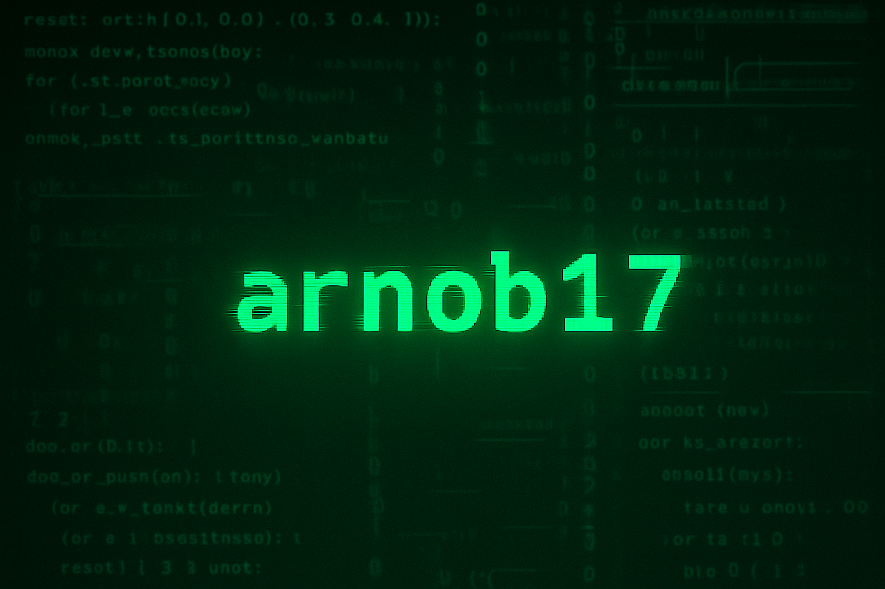

# 🌿 Arnob Rahman (Onu) — `Programmer, Poet, Dreamer`

> "Where code meets conscience, and every line has a purpose."

---

## 🧠 Who I Am

I'm **Arnob Rahman**, a full-stack developer, Literature and Science enthusiast - currently shaping impactful products at [Sara Tech Limited](https://saratech.com.bd), and leading the education revolution through **Aloion**, a student-run learning initiative for underprivileged youth.

When not coding, I explore classical Bengali music, poetry, and the fabric of space-time.

---

## 🚀 What I Do

- 🔧 **Backend Engineering** - `Node.js`, `NestJS, Express`, `TypeORM`, `PostgreSQL, MySQL`, `JWT`, `RTDN`
- 🖼️ **Frontend Engineering** - `React.js`, `Next.js`, `React-Router`, `TailwindCSS`
- ☁️ **DevOps** - GitHub Actions, PM2, Docker (in progress)
- 📊 **Aloion Founder** - Blending tech + education + empathy
- 🔐 **Writing** - I love writing, I love poems.

---

## 📂 Projects You Might Like

- [TrackaTail](TrackaTail) — A product of [Sara Tech Limited](https://saratech.com.bd), I was the backend engineer.
- [💡 Aloion](https://aloion.com) — A student-driven educational NGO empowering underserved learners
<!-- - [📦 ScanIt](https://scanit.com) — Enterprise file/document manager -->

---

## 🧘‍♂️ Philosophy

> "**Code with heart, build with purpose.**"

I believe in:
- Bengali minimalist design
- Slow tech, human-centered systems
- Empowering others with what I learn

---

## 📬 Reach Me

- 🔗 [LinkedIn](https://linkedin.com/in/arnob17)
- 📫 Email: `bluestone0037@gmail.com`
- 🧑‍🎓 Portfolio: *(Coming Soon)*

---

## 📌 Tech Stack

---

> “The world is going with its own law, doesn't care what we think or do. Its better to be like the world, that is the way to success in the world..”

---

