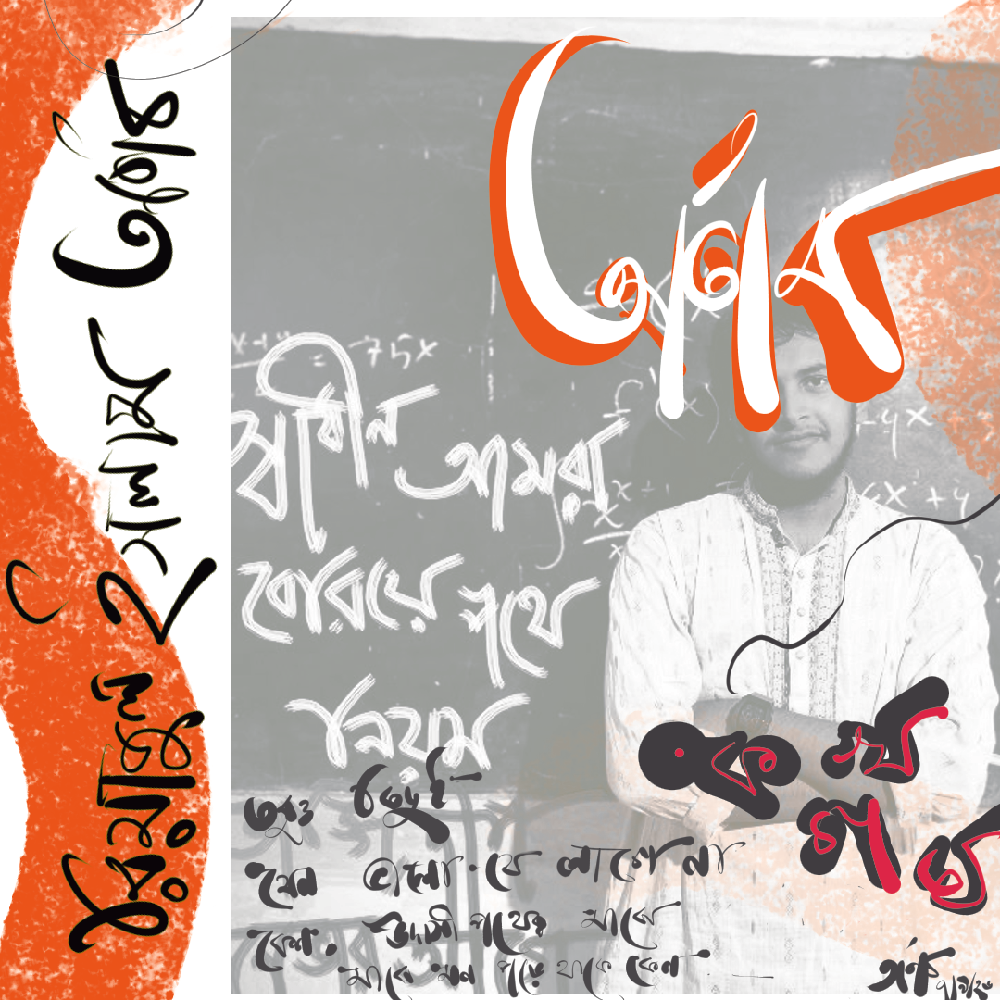

# 🌿 Arnob Rahman (Onu)
### `Programmer, Poet, Dreamer`

---

## Who I Am

I'm **Arnob Rahman**, a full-stack developer, literature and science enthusiast —
currently shaping products at [Sara Tech Limited](https://saratech.com.bd), and leading
the education initiative [Aloion](https://aloion.com).

I write software, read poetry, question things, and occasionally try to understand
the universe.

When I'm not coding, you'll probably find me somewhere between Bengali literature,
classical music, philosophy, and the fabric of space-time.

---

## What I Do

I'm primarily a **Backend Engineer**, though I build across the full stack when
the problem demands it.

I enjoy designing systems, building products, and figuring out how complicated
things work. Beyond software, I run **Aloion**, a student-led initiative working
towards a different kind of education.

I'm interested in the intersection of **technology, education, literature,
philosophy, and science**.

---

## Beyond Code

> *"Earth is brutally magical."*

I write poetry.  
I read literature.  
I think about physics.  
I listen to Bengali songs.  
And I spend an unreasonable amount of time wondering why things are the way they are.

### A little something I made

<!-- Put your artwork here -->

  

  <i>Something between mathematics, memory, and poetry.</i>

---

## Tech Stack

### Languages

### Tools

---

## Reach Me

- [LinkedIn](https://linkedin.com/in/arnob17)
- Email: `arnob17@tuta.io`
- Blogposts: [/writings](https://arnob17.vercel.app/writings)

---

> ~~"Earth is magical."~~  
> **"Earth is brutally magical."**  
> — Arnob, 2026
